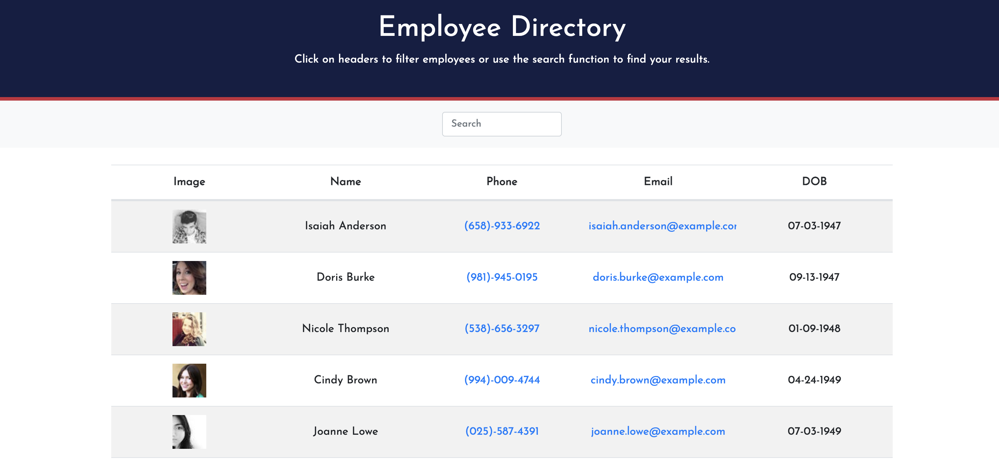

# Employee-Directory

---------------

## *Table of Contents*
- [Description](#description)
- [Installation](#installation)
- [Technologies](#technologies)
- [Contributing](#contributing)
- [Author](#author)

---------------

## *Description*
This application is designed to help a company have a directory of their employees with basic information about each employee. The application allows you to sort by name, email, phone number and email. There is also a search feature to search for a specific employee. The application UI is broken up into components, to be able to manage component state, and to respond to user events.

---------------

## *Installation*
npm install

---------------

## *Technologies*
- React
- Axios
- GH-Pages

---------------

## *Contributing*
Please use a new branch before contributing

---------------

## *Author*
- Hanna Munoz
- [Github](https://github.com/hannamunoz)
- [LinkedIn](https://www.linkedin.com/in/hanna-munoz-179993b2/)

---------------

This project is MIT licensed